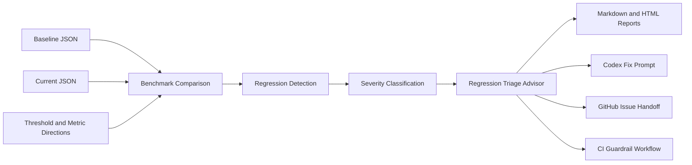

<div align="center">

# Codex Benchmark Guardian
### Benchmark Regression Detection · Codex Handoff Automation · CI Performance Guardrails

</div>

---

**Codex Benchmark Guardian** is a Python developer tool that turns raw benchmark comparisons into an actionable engineering workflow.

It helps developers:

- Compare baseline and current benchmark results
- Detect performance regressions across multiple metrics
- Calculate a deterministic Benchmark Release Readiness Score for merge decisions
- Explain likely causes with deterministic triage guidance
- Generate Codex-ready investigation and fix prompts
- Create GitHub issue handoff files
- Generate GitHub Actions benchmark guardrails
- Gate pull requests with persistent benchmark readiness comments
- Review results through a CLI or interactive Streamlit dashboard

Built for **OpenAI Build Week**, the project connects benchmark analysis directly to developer follow-through:

**benchmark comparison → regression detection → triage guidance → Codex fix prompt → GitHub issue handoff → CI guardrail**

No credentials, API keys, accounts, or external services are required.

---

## Judge Quickstart

```bash
git clone https://github.com/OmprakashSahani/codex-benchmark-guardian.git
cd codex-benchmark-guardian
pip install -e ".[dev]"
make lint
make format-check
make test
make demo-handoff
make demo-pr-gate-block
make demo-pr-gate-ready
make dashboard
```

Expected results:

- `make test` passes all 84 tests in the complete test suite.
- `make demo-handoff` generates the full Codex Handoff Pack under `reports/handoff/`.
- The bundled sample detects **2 regressions**: `latency_ms` and `throughput_rps`.
- The bundled handoff score is **50/100 — Block**.
- `make dashboard` launches the interactive Streamlit dashboard.

---

## What Judges Should Test

1. Run the local verification workflow:

```bash
make lint
make format-check
make test
```

2. Generate the complete handoff bundle:

```bash
make demo-handoff
```

3. Open the generated Markdown report:

```bash
cat reports/handoff/report.md
```

The report should show **4 compared metrics** and **2 regressions**:

- `latency_ms`
- `throughput_rps`

4. Launch the dashboard:

```bash
make dashboard
```

In the Streamlit dashboard:

- Keep bundled sample data selected
- Click **Run Analysis**
- Confirm the dashboard shows 4 compared metrics and 2 regressions
- Confirm the Benchmark Release Readiness section shows **Block**, **50/100**, and its recommendation
- Review the Regression Triage Advisor
- Open the Codex Fix Prompt section
- Open the GitHub issue handoff section
- Open the CI Guardrail workflow section
- Download generated reports and handoff artifacts if desired

---

## Demo

Demo video: [Codex Benchmark Guardian | OpenAI Build Week Demo](https://youtu.be/MLPgfpz6Vb0)

### Launch Interactive Dashboard

```bash
make dashboard
```

### Generate Complete Handoff Pack

```bash
make demo-handoff
```

---

## Core Systems

### Benchmark Comparison Engine

- Single-metric benchmark comparison
- Baseline and current JSON file loading
- Multi-metric comparison across matching numeric metrics
- Configurable regression thresholds
- Mixed-metric direction handling
- Deterministic change-percentage calculation

---

### Regression Intelligence

- `higher_is_worse` metric support
- `lower_is_worse` metric support
- Per-metric directions configuration
- Regression severity classification
- Summary counts and per-metric status
- CI-friendly non-zero failure mode

---

### Regression Triage Advisor

- Identifies the metric that regressed
- Maps common metrics to likely affected areas
- Explains why each regression matters
- Recommends concrete investigation steps
- Covers latency, runtime, memory, throughput, accuracy, recall, precision, and success-rate patterns

---

### Benchmark Release Readiness Score

- Starts at 100 and deducts 30 points per high, 20 per medium, and 10 per low regression
- Classifies scores as **Ready** (90–100), **Needs Review** (70–89), or **Block** (0–69)
- Provides a deterministic merge recommendation in reports, handoffs, and the dashboard

---

### Developer Handoff Automation

- Markdown benchmark report generation
- Self-contained HTML report generation
- Codex Fix Prompt generation
- GitHub issue handoff generation
- Suggested repository quality checks
- Complete Codex Handoff Pack generation

---

### Dashboard & CI Infrastructure

- Interactive Streamlit dashboard
- In-memory benchmark file uploads
- Built-in sample benchmark data
- Downloadable reports and handoff artifacts
- Deterministic GitHub Actions workflow generation
- Pull-request and push regression enforcement

---

## System Workflow



---

## Example Capabilities

### Project Information

```bash
cbg version
cbg about
```

### Compare a Higher-Is-Worse Metric

```bash
cbg compare latency_ms 100 125 --threshold 10
```

### Compare a Lower-Is-Worse Metric

```bash
cbg compare throughput_rps 1000 850 \
  --threshold 10 \
  --direction lower_is_worse
```

### Compare Benchmark Files

```bash
cbg compare-files examples/baseline.json examples/current.json \
  --threshold 10 \
  --directions-config examples/directions.json \
  --report reports/report.md
```

### Generate Markdown, HTML, and Codex Prompt Outputs

```bash
cbg compare-files examples/baseline.json examples/current.json \
  --threshold 10 \
  --directions-config examples/directions.json \
  --report reports/report.md \
  --html-report reports/report.html \
  --codex-prompt reports/codex_fix_prompt.md
```

### Run a Passing CI-Style Check

```bash
cbg compare-files examples/baseline.json examples/current_no_regression.json \
  --threshold 10 \
  --directions-config examples/directions.json \
  --report reports/report.md \
  --fail-on-regression
```

`--fail-on-regression` preserves report generation and exits with a non-zero status when regressions are detected, allowing benchmark regressions to block pull requests or deployments.

---

## Codex Handoff Pack

The Codex Handoff Pack connects benchmark detection to investigation, remediation, team communication, and CI enforcement.

### Run Bundled Sample

```bash
cbg handoff-pack
```

Plain `cbg handoff-pack` uses:

- `examples/baseline.json`
- `examples/current.json`
- `examples/directions.json`

### Run with Custom Benchmark Files

```bash
cbg handoff-pack \
  --baseline base.json \
  --current current.json \
  --direction higher_is_worse \
  --output-dir reports/handoff
```

### Run with Mixed Metric Directions

```bash
cbg handoff-pack \
  --baseline examples/baseline.json \
  --current examples/current.json \
  --directions-config examples/directions.json \
  --threshold 10 \
  --direction higher_is_worse \
  --output-dir reports/handoff
```

### Generated Artifacts

```text
reports/handoff/
├── report.md
├── report.html
├── codex_fix_prompt.md
├── github_issue.md
├── release_readiness.md
├── pr_comment.md
├── gate_summary.json
└── benchmark_guardian_ci.yml
```

- `report.md` — benchmark comparison with Regression Triage Advisor guidance
- `report.html` — self-contained browser-friendly report
- `codex_fix_prompt.md` — ready-to-use Codex investigation and fix task
- `github_issue.md` — issue-ready regression summary and engineering handoff
- `release_readiness.md` — deterministic release score, classification, and merge recommendation
- `benchmark_guardian_ci.yml` — GitHub Actions benchmark guardrail
- `pr_comment.md` — persistent pull-request gate comment
- `gate_summary.json` — deterministic gate enforcement contract

When no regressions are detected, the pack is still generated and records that no regression fix or issue is currently required.

---

## GitHub PR Benchmark Gate

The PR gate turns the deterministic handoff into a **Block → Fix → Ready** workflow. Generate it with:

```bash
cbg init-pr-gate
```

This writes `.github/workflows/benchmark-pr-gate.yml`. On `pull_request` opened, synchronized, and reopened events, the `benchmark-pr-gate` job builds the Handoff Pack, uploads it as an artifact, adds the generated comment to the job summary, and enforces its stored release-readiness result. The comment has a stable marker, so subsequent benchmark runs update one persistent comment rather than creating duplicates. A Block fails the check; Ready and Needs Review pass it.

For same-repository pull requests, the workflow can comment with minimum `contents: read`, `issues: write`, and `pull-requests: write` permissions. Fork PRs still run analysis and artifact upload, but skip comments for safety. Enable **benchmark-pr-gate** as a required status check in your repository rules after committing the workflow.

Run the local demonstrations:

```bash
make demo-pr-gate-block
make demo-pr-gate-ready
make demo-init-pr-gate
```

The complete Handoff Pack artifact includes `pr_comment.md` and `gate_summary.json` alongside reports, the Codex prompt, issue handoff, CI workflow, and release readiness.

---

## Streamlit Dashboard

Run locally with:

```bash
streamlit run app.py
```

Or use:

```bash
make dashboard
```

The dashboard allows users to:

- Use bundled sample benchmark data
- Upload baseline and current JSON files
- Upload an optional per-metric directions config
- Select a regression threshold
- Select a fallback metric direction
- Run the same comparison engine used by the CLI
- View comparison totals and regression counts
- View the release readiness label, score, and recommendation near the analysis summary
- Inspect metric status and severity
- Review Regression Triage Advisor guidance
- Preview the generated Codex Fix Prompt
- Preview the GitHub issue handoff
- Preview the generated CI workflow
- Download Markdown, HTML, Codex prompt, issue, CI, and release readiness artifacts

For Streamlit Community Cloud, use `app.py` as the entry file and `requirements.txt` for deployment dependencies.

---

## Metric Direction

Codex Benchmark Guardian supports two regression directions:

- `higher_is_worse` — increases can represent regressions; useful for latency, runtime, memory, and error rate
- `lower_is_worse` — decreases can represent regressions; useful for throughput, accuracy, recall, precision, and success rate

`--direction` provides the global fallback. `--directions-config` can override the direction for individual metrics in mixed benchmark files.

Example `examples/directions.json`:

```json
{
  "latency_ms": "higher_is_worse",
  "memory_mb": "higher_is_worse",
  "runtime_s": "higher_is_worse",
  "throughput_rps": "lower_is_worse"
}
```

The resolved direction for every metric is displayed in CLI output and generated reports.

---

## Example Diagnostics

### Single-Metric Comparison

```text
Metric: latency_ms
Baseline: 100.0
Current: 125.0
Change: 25.00%
Threshold: 10.00%
Direction: higher_is_worse
Regression detected | Severity: high
```

---

### File Comparison

```text
Compared 4 metrics
Regressions detected: 2
Report written to: reports/report.md
```

---

### Benchmark Report

```markdown
# Benchmark Comparison Report

Compared metrics: 4
Regressions detected: 2

| Metric | Direction | Baseline | Current | Change | Threshold | Status | Severity |
| --- | --- | ---: | ---: | ---: | ---: | --- | --- |
| latency_ms | higher_is_worse | 100 | 125 | 25.00% | 10.00% | Regression | high |
| memory_mb | higher_is_worse | 256 | 260 | 1.56% | 10.00% | OK | none |
| runtime_s | higher_is_worse | 2.5 | 2.7 | 8.00% | 10.00% | OK | none |
| throughput_rps | lower_is_worse | 1000 | 850 | -15.00% | 10.00% | Regression | medium |
```

---

## Regression Triage Examples

### Latency Regression

The advisor may recommend checking:

- Recent request-path changes
- Added I/O, retries, sleeps, or serialization work
- Network calls and dependency timing
- Database queries and cache hit rates
- Benchmark host load and environment noise

### Throughput Regression

The advisor may recommend checking:

- Concurrency limits and worker counts
- Queue behavior and backpressure
- CPU utilization and lock contention
- Database connection-pool usage
- External service rate limits
- Benchmark duration and request mix

This turns a raw regression signal into a focused engineering investigation.

---

## Codex Fix Prompt Generator

The Codex Fix Prompt Generator produces a deterministic Markdown task containing:

- Project title
- Comparison totals
- Regressed metrics only
- Metric directions
- Baseline and current values
- Change percentages
- Regression severity
- Triage guidance
- Suggested quality checks

When regressions are found, the prompt asks Codex to inspect the repository, identify likely causes, implement a minimal fix, add or update tests, and run:

```bash
make lint
make format-check
make test
make demo-ci
```

When no regression is detected, the generated prompt records that no fix is needed and recommends continued benchmark stability review.

---

## CI Guardrail Generator

Generate a benchmark guardrail workflow with:

```bash
cbg init-ci
```

Default output:

```text
.github/workflows/benchmark-guardian.yml
```

The generated workflow:

- Runs on `push` and `pull_request`
- Uses Ubuntu and Python 3.12
- Installs the project with development dependencies
- Executes benchmark comparison with `--fail-on-regression`
- Generates Markdown, HTML, and Codex prompt artifacts
- Fails when configured performance regressions are detected

Customized example:

```bash
cbg init-ci \
  --baseline examples/baseline.json \
  --current examples/current_no_regression.json \
  --directions-config examples/directions.json \
  --threshold 10 \
  --python-version 3.12 \
  --output .github/workflows/benchmark-guardian.yml
```

---

## Built with Codex and GPT-5.6

I used **Codex with GPT-5.6** throughout the project to accelerate implementation, review edge cases, and improve engineering quality.

Codex helped implement and refine:

- JSON benchmark comparison
- Multi-metric regression detection
- Metric direction handling
- Per-metric configuration
- Markdown and HTML report generation
- Regression Triage Advisor guidance
- Codex Fix Prompt generation
- CI regression failure behavior
- GitHub Actions workflow generation
- Streamlit dashboard workflows
- Codex Handoff Pack generation
- GitHub issue handoff generation
- Makefile commands
- Unit and CLI tests

Codex reviews also helped identify important edge cases involving:

- Passing and intentionally failing CI demos
- Generated workflow output paths
- Safe quoting of workflow command paths
- Dashboard-generated CI YAML matching dashboard inputs
- Mixed-metric direction handling
- Relative, `./`, and absolute sample-file paths

All suggestions were reviewed manually and verified with Ruff, Pytest, demo commands, and the working Streamlit dashboard.

---

## Installation and Testing

Codex Benchmark Guardian is a Python-based developer tool with both a CLI and an interactive Streamlit dashboard.

### Supported Platforms

- Linux
- macOS
- Windows
- GitHub Codespaces

### Requirements

- Python 3.12 or newer
- pip
- Git

### Installation

```bash
git clone https://github.com/OmprakashSahani/codex-benchmark-guardian.git
cd codex-benchmark-guardian
pip install -e ".[dev]"
```

### Verify Installation

```bash
cbg version
cbg about
```

### Run Quality Checks

```bash
make lint
make format-check
make test
```

Expected result:

```text
72 passed
```

---

## Engineering Focus

Codex Benchmark Guardian focuses on:

- Performance regression detection
- Developer-oriented benchmark diagnostics
- Deterministic automation
- Actionable Codex handoffs
- CI performance enforcement
- Reproducible JSON-based workflows
- Low-friction integration with existing repositories

---

## Project Structure

```text
.
├── .github/workflows/ci.yml      # GitHub Actions quality checks
├── examples/                     # Example benchmark inputs
│   ├── baseline.json
│   ├── current.json
│   ├── current_no_regression.json
│   └── directions.json
├── app.py                        # Streamlit dashboard
├── reports/                      # Generated reports and handoff artifacts
├── src/codex_benchmark_guardian/ # Core package and CLI
│   ├── benchmarks.py
│   ├── ci.py
│   ├── cli.py
│   ├── handoff.py
│   ├── regression.py
│   ├── report.py
│   └── triage.py
├── tests/                        # Pytest suite
├── pyproject.toml                # Package and tool configuration
├── requirements.txt              # Streamlit deployment dependencies
├── Makefile                      # Development and demo commands
└── README.md
```

---

## Makefile Commands

```bash
make install        # Install development dependencies
make lint           # Run Ruff lint checks
make format-check   # Verify Ruff formatting
make test           # Run the Pytest suite
make dashboard      # Launch the Streamlit dashboard
make demo           # Generate report and Codex prompt demo artifacts
make demo-ci        # Run a passing CI-style regression check
make demo-handoff   # Generate the complete Codex Handoff Pack
make demo-init-ci   # Generate a local CI workflow demo artifact
make demo-ci-fail   # Demonstrate expected CI regression failure
make clean-reports  # Remove generated report artifacts
```

- `make demo` demonstrates regression reporting without failing the command.
- `make demo-ci` uses non-regressing sample data with `--fail-on-regression`.
- `make demo-handoff` writes the complete handoff bundle to `reports/handoff/`.
- `make demo-init-ci` writes a workflow copy to `reports/benchmark_guardian_ci.yml`.
- `make demo-ci-fail` intentionally detects regressions and confirms expected CI failure handling.

---

## CI & Reliability

Codex Benchmark Guardian includes:

- Automated unit and CLI testing
- Ruff lint validation
- Ruff formatting validation
- Deterministic sample benchmark inputs
- Passing and intentionally failing CI demos
- Benchmark regression enforcement
- GitHub Actions quality checks

Run the complete local verification workflow:

```bash
make lint
make format-check
make test
```

Latest verified result:

```text
72 passed
```

---

## Technical Highlights

- 72 verified automated tests
- Single-metric and multi-metric comparison
- Mixed metric-direction configuration
- Regression severity classification
- Regression Triage Advisor
- Markdown and self-contained HTML reports
- Codex Fix Prompt generation
- GitHub issue handoff generation
- Streamlit benchmark dashboard
- Deterministic GitHub Actions guardrail generation
- CI failure behavior with `--fail-on-regression`
- Complete Codex Handoff Pack workflow
- No external service or credential requirement

---

## Project Philosophy

Codex Benchmark Guardian treats benchmark detection as the beginning of the engineering workflow, not the end.

The project focuses on helping developers understand:

- What changed
- Whether the change is a regression
- Why the regression matters
- Where to investigate
- How to hand the problem to Codex
- How to communicate it through GitHub
- How to prevent recurrence through CI

The goal is to move from raw performance numbers to an actionable, reproducible, developer-friendly response.

---

## License

MIT. See [`LICENSE`](LICENSE).

---

<div align="center">

*Omprakash Sahani — ML Systems Engineer · Software Engineer · Distributed Systems*

</div>
