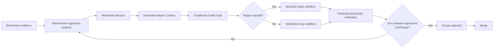
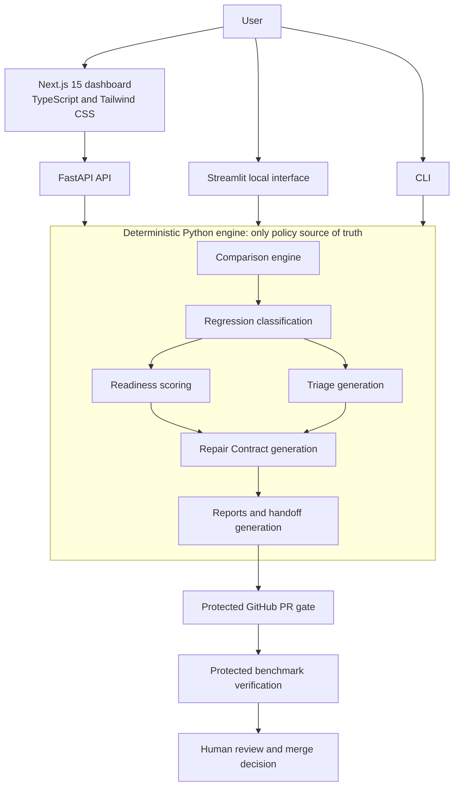

<div align="center">

# Codex Benchmark Guardian

### Evidence-backed performance repair for pull requests

[Production dashboard](https://codex-benchmark-guardian.vercel.app) · [Repository](https://github.com/OmprakashSahani/codex-benchmark-guardian) · [Real PR #20 proof](https://github.com/OmprakashSahani/codex-benchmark-guardian/pull/20)

</div>

---

**Codex Benchmark Guardian turns a real performance regression into a bounded Codex repair task, verifies the proposed fix against protected benchmark evidence, and safely returns the pull request to Ready.**

It connects deterministic benchmark analysis to a conditional repair workflow without allowing an agent to decide its own success. Python is the only source of benchmark, readiness, and repair-policy truth; the production Next.js dashboard and FastAPI API expose that engine without reimplementing its business rules.

The final merge remains a human decision.

## Why It Matters

A benchmark failure is only the start of a repair. A useful system must preserve the evidence, explain what regressed, constrain what may change, distinguish repair from verification, and prove the outcome with a trusted evaluator.

Codex Benchmark Guardian provides that chain:

- deterministic comparison across higher-is-worse and lower-is-worse metrics
- severity classification, readiness scoring, and evidence-backed triage
- an immutable Repair Contract and a conditional Codex Goal
- bounded repair instructions only when material regressions exist
- a verification-only path that avoids speculative changes when evidence is clean
- a protected GitHub PR gate that makes the final benchmark-readiness decision
- a complete, portable Handoff Pack for review and automation

## Judge Quickstart

Start with the [live production dashboard](https://codex-benchmark-guardian.vercel.app), then verify the repository locally:

```bash
git clone https://github.com/OmprakashSahani/codex-benchmark-guardian.git
cd codex-benchmark-guardian
pip install -e ".[dev,dashboard]"
make lint
make format-check
make test
npm install
npm run lint
npm run typecheck
npm run build
```

Expected Python test result:

```text
162 passed
```

Generate a CLI handoff and exercise both protected-gate outcomes:

```bash
make demo-handoff
make demo-pr-gate-block
make demo-pr-gate-ready
```

The first command writes the CLI Handoff Pack to `reports/handoff/`. The gate demonstrations intentionally show a blocked regression and a Ready result. For the additional local Python-first interface:

```bash
streamlit run app.py
```

## Live Production Experience

The primary product experience is the [production Next.js/FastAPI dashboard](https://codex-benchmark-guardian.vercel.app). Its result workspace is organized into five tabs:

1. **Overview**
2. **Metrics**
3. **Triage**
4. **Codex Goal**
5. **Handoff Pack**

Users can:

- load permanent example scenarios
- upload or edit baseline, current, and direction JSON
- configure the threshold and per-metric directions
- run the deterministic Python analysis engine through FastAPI
- inspect readiness, metrics, severity, and triage
- copy or download the conditional Codex Goal
- inspect and download the complete Handoff Pack
- replay the real PR #20 regression and verified fix

The dashboard defaults to a **10%** regression threshold. This repository's protected PR gate uses **25%** to evaluate pull requests.

Until a new submission video is recorded, the production dashboard is the primary demo. The existing [YouTube video](https://youtu.be/MLPgfpz6Vb0) is an earlier prototype demonstration and does not represent the current production experience.

## Verified Repair Loop



### Repair-required path

When material regressions exist, the generated goal directs Codex to:

1. inspect the relevant implementation and history
2. identify evidence-backed root-cause hypotheses
3. implement the smallest maintainable correction
4. add or update regression tests
5. run only approved validation commands
6. rerun the relevant benchmark
7. review the final diff
8. obtain fresh protected evidence
9. confirm zero material regressions and **Ready** status
10. leave merge approval to a human

Failure or incomplete evidence repeats the bounded analysis-and-repair loop; it does not authorize policy changes.

### Verification-only path

When the result has zero material regressions, the system does not invent repair work. The generated goal requires the user or agent to:

1. make no speculative code repair or speculative test change
2. inspect the supplied evidence
3. confirm that the protected workflow or trusted evaluator completed
4. confirm zero material regressions and **Ready** status
5. review the final diff only when changes already exist
6. preserve human approval before merge
7. continue monitoring benchmark stability

The dashboard hides the legacy speculative fix prompt from verification-only users. The API retains its `codex_fix_prompt` field solely for backward compatibility; `codex_repair_goal.md` is the canonical handoff for both paths.

## Real Regression-to-Fix Proof: PR #20

[Pull request #20](https://github.com/OmprakashSahani/codex-benchmark-guardian/pull/20) demonstrates the complete loop with real protected evidence.

| Stage | Result |
| --- | --- |
| Regression metric | `pr_gate_generation_latency_ms` |
| Harmful change | **+135.21%** |
| Protected threshold | **25%** |
| Severity | **critical** |
| Initial readiness | **Needs Review** |
| Initial score | **70/100** |
| Verified fix | **zero material regressions** |
| Final readiness | **Ready** |
| Final score | **100/100** |

- [Regression workflow](https://github.com/OmprakashSahani/codex-benchmark-guardian/actions/runs/29634627579)
- [Verified-fix workflow](https://github.com/OmprakashSahani/codex-benchmark-guardian/actions/runs/29635217444)

Workflow artifacts eventually expire, so the evidence used to replay both states is committed permanently under `examples/scenarios/pr-20/`. The protected verifier established benchmark readiness; Codex did not autonomously merge the pull request.

## Repair Contract and Safety Model

Every analysis produces an immutable Repair Contract from the Python engine. It records the evidence, whether repair is required, allowed and forbidden actions, validation commands, and completion criteria. The Codex Goal is derived from this contract rather than from an open-ended request to improve performance.

Codex may inspect, edit, test, benchmark, and review a bounded repair. It may not:

- lower or bypass thresholds
- change metric directions to suppress failures
- manipulate original or fresh benchmark evidence
- substitute a selectively chosen passing run
- weaken the protected harness
- weaken the protected evaluator
- relax or delete tests merely to pass
- hard-code expected benchmark results
- self-declare the pull request Ready
- automatically merge the pull request

Protected verification declares benchmark readiness. A human still reviews and approves the merge.

## Handoff Pack

`codex_repair_goal.md` is always the primary and default handoff. Dashboard downloads use review-friendly names.

### Dashboard artifacts

Repair-required results expose:

1. `codex_repair_goal.md`
2. `repair_contract.md`
3. `repair_contract.json`
4. `benchmark-report.md`
5. `benchmark-report.html`
6. `codex-fix-prompt.txt`
7. `github-issue.md`
8. `benchmark-workflow.yml`
9. `release-readiness.md`

Verification-only results expose the same set except `codex-fix-prompt.txt`, because no speculative repair prompt is appropriate.

### CLI artifacts

Run:

```bash
cbg handoff-pack \
  --baseline examples/baseline.json \
  --current examples/current.json \
  --directions-config examples/directions.json \
  --threshold 10 \
  --output-dir reports/handoff
```

The CLI preserves established filenames. The equivalents of the dashboard report, prompt, issue, workflow, and readiness downloads are `report.md`, `report.html`, `codex_fix_prompt.md`, `github_issue.md`, `benchmark_guardian_ci.yml`, and `release_readiness.md`. It also writes `codex_repair_goal.md`, `repair_contract.md`, `repair_contract.json`, `pr_comment.md`, and `gate_summary.json`.

The CLI currently retains `codex_fix_prompt.md` in a generated verification-only pack for compatibility. Consumers should use the conditional `codex_repair_goal.md` as the authoritative handoff.

## Architecture

The production application uses the **Next.js 15 App Router**, **TypeScript**, and **Tailwind CSS** for presentation, with **FastAPI** exposing the deterministic Python engine. Streamlit remains available as an additional local interface.



Benchmark rules, readiness scoring, and repair policy are not duplicated in TypeScript. The frontend renders API results from the Python source of truth.

## Permanent Example Scenarios

The production dashboard includes five scenarios:

- **Standard regression** — the normal regression walkthrough
- **Material regression** — the same evidence evaluated at the higher, more permissive 25% threshold rather than the standard scenario's 10% threshold; 10% flags smaller harmful changes, while 25% tolerates more variation and therefore flags fewer regressions, and the repository's protected PR gate uses 25% to account conservatively for shared-runner timing noise
- **Clean benchmark** — the verification-only path
- **PR #20 regression** — the real protected regression evidence
- **PR #20 verified fix** — the real Ready evidence after repair

Scenario inputs live in `examples/scenarios/` as baseline, current, and metric-direction JSON. They can be loaded, edited, and rerun through the current Python engine.

## CLI and Local Interfaces

### Compare benchmark files

```bash
cbg compare-files examples/baseline.json examples/current.json \
  --threshold 10 \
  --directions-config examples/directions.json \
  --report reports/report.md \
  --html-report reports/report.html \
  --fail-on-regression
```

`--fail-on-regression` still generates reports and exits nonzero when a material regression is detected. Metric directions may be `higher_is_worse` (for latency, runtime, memory, or error rate) or `lower_is_worse` (for throughput, accuracy, recall, precision, or success rate). `--direction` sets a fallback and `--directions-config` supplies per-metric overrides.

Useful discovery commands:

```bash
cbg version
cbg about
cbg --help
```

### Streamlit

Streamlit is an additional local, Python-first interface—not the primary production dashboard:

```bash
streamlit run app.py
# or
make dashboard
```

It uses the same Python comparison and reporting engine as the CLI and API.

## GitHub PR Benchmark Gate

The protected gate benchmarks the exact protected base SHA and PR head in separate environments on the same runner. Its fixed workload uses warm-ups and repeated high-resolution measurements, then compares median results. The **25%** repository threshold is intentionally separate from the dashboard's **10%** exploratory default.

The protected-base harness controls what is measured. The protected-base evaluator controls comparison, readiness, PR comments, and final enforcement. Provenance records the harness and evaluator sources, while fork pull requests benchmark and upload evidence without receiving write access for comments.

Local demonstrations:

```bash
cbg init-pr-gate
make demo-pr-gate-block
make demo-pr-gate-ready
make demo-init-pr-gate
```

Repositories adopting the generated gate should make `benchmark-pr-gate` a required status check. They may replace the project benchmark workload, but a proposed repair must not weaken the protected harness or evaluator.

## Built with Codex and GPT-5.6

### Codex contributions

Codex with GPT-5.6 helped with:

- implementation planning and focused code changes
- test generation and refinement
- API and frontend integration
- review of security and compatibility edge cases
- pull-request review
- finding and fixing the verification-only legacy-prompt exposure
- validating bounded Repair Contract behavior

### Human design and approval

The human developer defined and approved:

- the product problem and readiness policy
- the safety boundaries and protected evidence model
- repair-required versus verification-only behavior
- the user experience and scope decisions
- review acceptance and production deployment
- final merge decisions

Codex assisted with implementation and review; it did not independently design, approve, deploy, or merge the project.

## Installation and Verification

Requirements include Python 3.12 or newer, Node.js with npm, pip, and Git.

```bash
git clone https://github.com/OmprakashSahani/codex-benchmark-guardian.git
cd codex-benchmark-guardian
pip install -e ".[dev,dashboard]"
npm install
```

Run the complete repository checks:

```bash
make lint
make format-check
make test
npm run lint
npm run typecheck
npm run build
```

The current Python suite contains **162 tests**.

## Project Structure

```text
.
├── api/
│   └── index.py                       # FastAPI adapter for the Python engine
├── app/                               # Next.js 15 App Router application
├── components/                        # Production dashboard components
├── lib/                               # Frontend types, fixtures, and adapters
├── src/codex_benchmark_guardian/      # Deterministic Python source of truth
│   ├── regression.py                  # Comparison and classification
│   ├── release_readiness.py           # Readiness scoring
│   ├── repair.py                      # Repair Contract and conditional goal
│   ├── report.py                      # Markdown and HTML generation
│   ├── handoff.py                     # Canonical CLI Handoff Pack
│   └── pr_gate.py                     # Protected-gate result generation
├── benchmarks/                        # Protected benchmark harness
├── examples/scenarios/                # Permanent dashboard and PR #20 evidence
├── tests/
│   ├── test_api.py                    # API contract coverage
│   └── test_repair.py                 # Repair-policy coverage
├── app.py                             # Additional Streamlit interface
├── AGENTS.md                          # Repository repair boundaries
└── README.md
```

## License

MIT. See [`LICENSE`](LICENSE).

---

<div align="center">

*Omprakash Sahani — ML Systems Engineer · Software Engineer · Distributed Systems*

</div>
